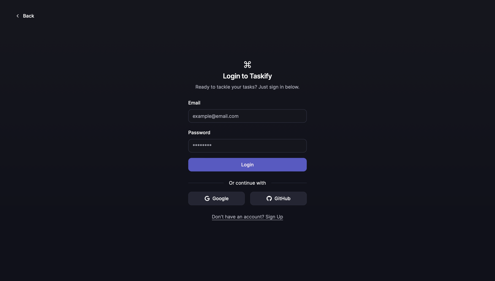
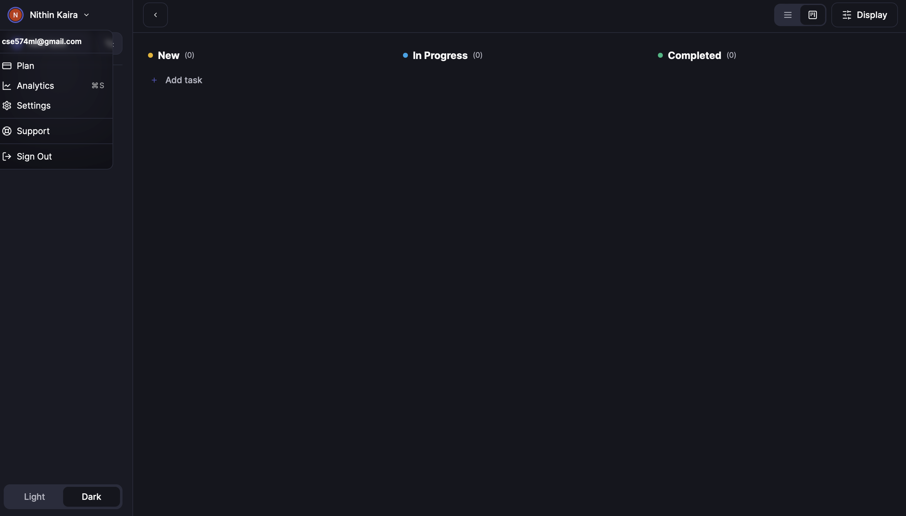
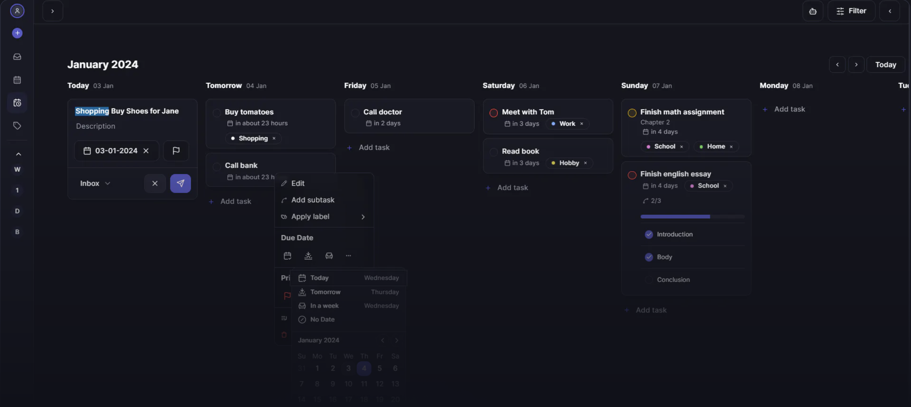

  Task Manager app with modern features.

 

### APP Features
- Natural Language Processing (NLP)
- Mention-driven task assignments via @ or #
- Lists and labels
- Speech Recognition
- Subtasks
- Reccuring tasks
- Filtering tasks
- Multiple views
- Dark and light mode
- Loading skeleton states for everything

### Landing page
- Docs page
- Pure CSS animations and fade in animations 
- Interactive preview components
- Just overall sleek and modern designed

### Libraries and technologies
- .NET Web API
- C# and Typescript
- Next.js14
- TailwindCSS
- PostgreSQL
- Prisma
- Zustand (state management)
- SWR (stale-while-revalidate strategy)
- zod
- react-speech-recognition
- reusable components
- openai API (AI)